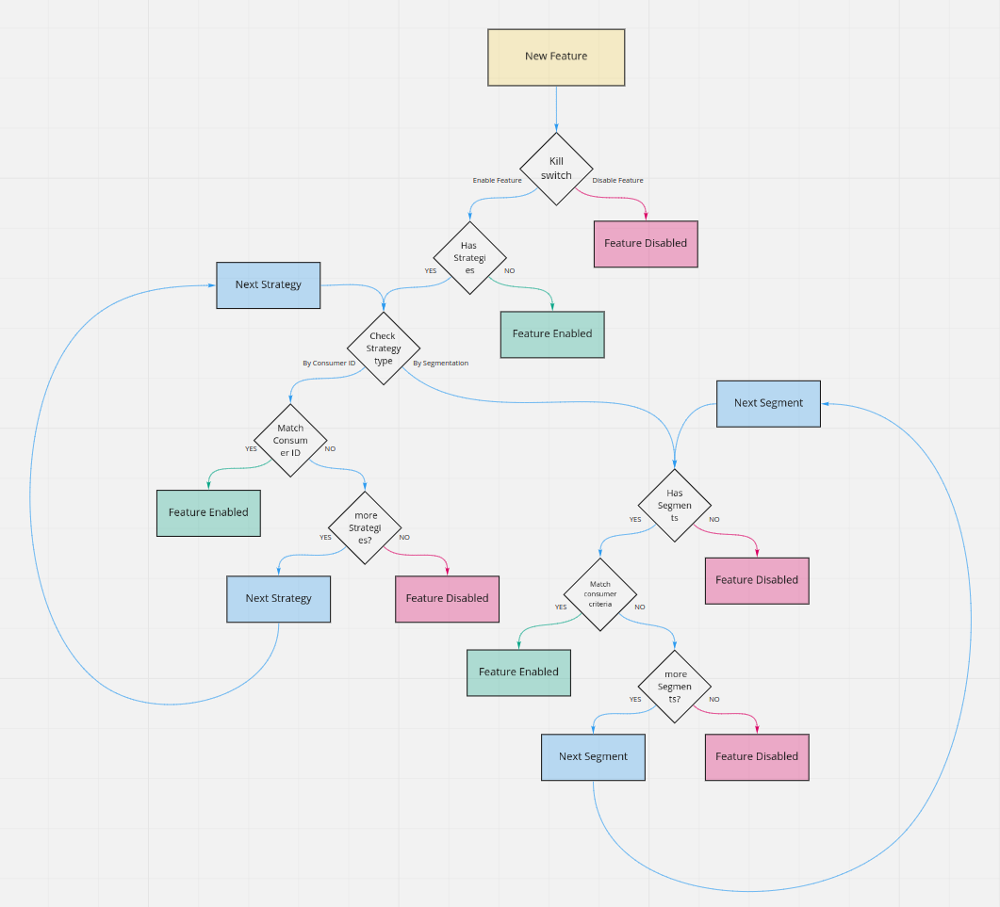

# Architecture

Pheature flags is a framework based on several components, that allows creating more or less complex feature releasing systems. 
Because of its modular design, you can use it in a monolith or distributed architectures.

## Toggle

Toggle is the core component of the Pheature flags system. It is the semaphore who will allow running one or another part of application code.

A toggle will be enabled or disable based on a [kill switch](#kill-switch), [Toggle Strategies](#toggle-strategies) and [Segments](#segments).

### Kill Switch

The kill switch is the highest level of the toggle control measures, it allows disabling a feature.
When the kill switch is bypassed, then the next level controls AKA [Toggle Strategies](#toggle-strategies) will be checked.   
When there isn't any Toggle strategy enabled, the kill switch will be the unique control on enabling/disabling a Feature. 

### Toggle Strategies

The Toggle Strategies are the second level control measure in our feature release system, once the kill switch is bypassed,
a toggle will check the [Consumer Identity](#consumer-identity) against the enabled strategies. When one of the strategies
matches the given identity, then the feature should be enabled, else it should be disabled by default.

The Toggle Strategies can be of two types:

**Based in Consumer Identity**
  
It will check if the given consumer identity matches against a list of enabled consumer identities.

**Based in Segmentation**

It will check if the given identity payload matches with the matching [segment](#segments) criteria.

### Consumer Identity

The Consumer identity is composed by two parts, the id itself and the consumer payload.The ID, is a unique string that 
identifies the current request client. The payload is extra data attached to the identity that will be matched against segments. 

### Segments

A segment is part of one or more strategies, it defined the criteria that a consumer must have in its payload to enable a feature.

### Flow

*The following picture describes the toggle flow diagram:*

## Management API

> Coming soon

## Client API

> Coming soon

## Management UI

> Coming soon
