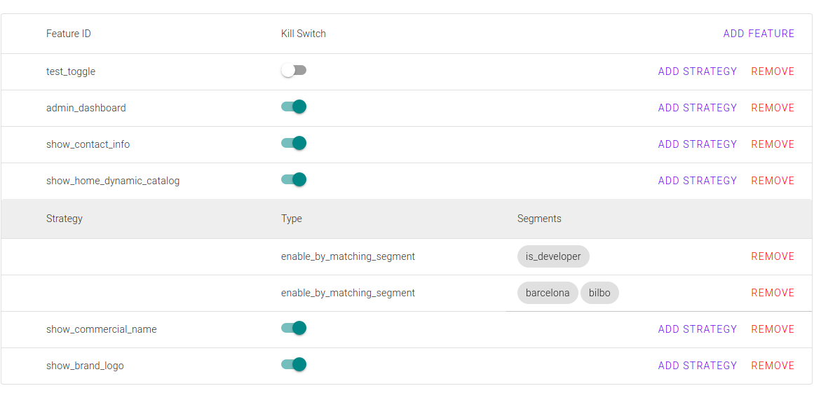

# Toggle UI

Pheature-flags library, Web-Component based Admin User Interface.

> [Checkout official repository](https://github.com/pheature-flags/toggle-ui)



## Requirements

* npm

## Installation

This is an experimental feature, you should clone it from git.

```bash
git clone git@github.com:pheature-flags/toggle-ui.git
cd tçggle-ui
```

Using npm:

```bash
npm install 
npm run start
# open other terminal
npm run dev-api
```

Using yarn:

```bash
yarn 
yarn start
# open other terminal
yarn dev-api
```

## Usage

See [the html index](index.html) file.

```html
<toggle-list api-url="http://127.0.0.1:3000"></toggle-list>
```

## Config

* **api-url**: It should be the endpoint configured for the [pheature-flags/toggle-crud-psr7-api](https://github.com/pheature-flags/toggle-crud-psr7-api)
